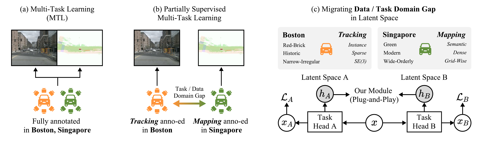

# NexusFlow: Unifying Disparate Tasks under Partial Supervision via Invertible Flow Networks

[](https://arxiv.org/abs/2512.06251)
[](#)

Official code release for our **CVPR 2026** paper, *NexusFlow: Unifying
Disparate Tasks under Partial Supervision via Invertible Flow Networks*.

## News

- **2026.02** &nbsp; NexusFlow is accepted to **CVPR 2026**. 🎉
- **2025.12** &nbsp; arXiv preprint released: [arXiv:2512.06251](https://arxiv.org/abs/2512.06251).

## TL;DR

When you train a multi-task BEV perception model and each sample only carries
labels for *some* tasks (e.g. dense mapping labels here, sparse tracking
labels there), the partial-supervision signal can drag the shared
representation apart. **NexusFlow** is a lightweight, plug-and-play module that
sits *alongside* the main model: two surrogate networks read the shared BEV
feature, squash it with deformable attention, push it through an invertible
RealNVP-style coupling layer, and align the two outputs with a simple MSE
loss. No architectural change to your main model, no extra labels required.

See [`materials/readme.md`](materials/readme.md) for the architecture and
pseudo-code, and [`materials/NexusFlow.py`](materials/NexusFlow.py) for a
standalone runnable implementation.

## Problem setup



Each sample carries labels for only a subset of tasks. Without intervention, the
partial-supervision signal pulls the shared BEV representation in incompatible
directions; NexusFlow aligns the per-task views of the feature without requiring
any additional labels. A higher-resolution version is available as
[`nexusflow_probsetup.pdf`](nexusflow_probsetup.pdf).

## Qualitative results

| Baseline (UniAD) | Ours (UniAD + NexusFlow) |
|---|---|
| [`materials/Baseline_with_map.avi`](materials/Baseline_with_map.avi) | [`materials/Ours_with_map.avi`](materials/Ours_with_map.avi) |

## Repository layout

```
opensource_code/
├── README.md                          # this file
├── nexusflow_probsetup.png            # problem-setup figure (rasterized)
├── nexusflow_probsetup.pdf            # problem-setup figure (vector)
├── base.py                            # → mmdet/.../detectors/base.py
├── builder.py                         # → mmdet3d/datasets/builder.py
├── dataset_wrappers.py                # → mmdet3d/datasets/dataset_wrappers.py
├── epoch_based_runner.py              # → mmcv/runner/epoch_based_runner.py
├── mmdet_train.py                     # → UniAD/.../uniad/apis/mmdet_train.py
├── nuscenes_e2e_dataset.py            # → UniAD/.../datasets/nuscenes_e2e_dataset.py
├── data_classes.py                    # → nuscenes/eval/detection/data_classes.py
├── evaluate_single_city_eval.py       # → nuscenes/eval/tracking/evaluate.py
└── materials/
    ├── NexusFlow.py                   # standalone NexusFlow module + demo
    ├── readme.md                      # standalone NexusFlow doc
    ├── Baseline_with_map.avi          # qualitative video — baseline
    └── Ours_with_map.avi              # qualitative video — ours
```

## Setup

The whole stack is built on top of [UniAD](https://github.com/OpenDriveLab/UniAD).
We do **not** repackage UniAD's environment here — please first follow the
upstream [UniAD installation guide](https://github.com/OpenDriveLab/UniAD/blob/main/docs/INSTALL.md)
to set up the conda environment (we use Python 3.9, env name `uniad2.0`) and
clone UniAD to `/root/UniAD`. Once that works, drop the files in this folder
into the paths listed below.

## File index — drop-in replacements

Each file in this folder is a modified copy of an upstream file. Replace the
file at the target path with the one here.

| File in this repo | Drop-in target path |
|---|---|
| `base.py` | `/root/miniconda3/envs/uniad2.0/lib/python3.9/site-packages/mmdet/models/detectors/base.py` |
| `builder.py` | `/root/miniconda3/envs/uniad2.0/lib/python3.9/site-packages/mmdet3d/datasets/builder.py` |
| `dataset_wrappers.py` | `/root/miniconda3/envs/uniad2.0/lib/python3.9/site-packages/mmdet3d/datasets/dataset_wrappers.py` |
| `epoch_based_runner.py` | `/root/mmcv/mmcv/runner/epoch_based_runner.py` |
| `mmdet_train.py` | `/root/UniAD/projects/mmdet3d_plugin/uniad/apis/mmdet_train.py` |
| `nuscenes_e2e_dataset.py` | `/root/UniAD/projects/mmdet3d_plugin/datasets/nuscenes_e2e_dataset.py` |
| `data_classes.py` | `/root/miniconda3/envs/uniad2.0/lib/python3.9/site-packages/nuscenes/eval/detection/data_classes.py` |
| `evaluate_single_city_eval.py` | `/root/miniconda3/envs/uniad2.0/lib/python3.9/site-packages/nuscenes/eval/tracking/evaluate.py` |

The two `/root/UniAD/...` paths live inside the UniAD repo itself; the
`mmdet` / `mmdet3d` / `nuscenes` paths live inside your conda env's
site-packages; `mmcv` is a source-installed clone at `/root/mmcv`. Adjust the
`/root/miniconda3/envs/uniad2.0/...` prefix to wherever your own environment
lives.

### Notes on the eval files

- `evaluate_single_city_eval.py` restricts the nuScenes tracking eval to a
  single city. Look for the block marked `# <<< MOD: filter both pred & gt
  to only samples in target city` (around line 106) and change `target_city`
  (default `singapore`) for a different split.
- `data_classes.py` mirrors the nuScenes **detection** eval data classes; it
  is included because the eval stack imports from it.

## Running the standalone NexusFlow demo

```bash
pip install torch deformable-attention-pytorch
python materials/NexusFlow.py
```

This builds the module, runs a forward/backward pass on a random BEV feature,
and prints the alignment loss.

## Citation

If you find this work useful, please cite:

```bibtex
@article{lin2025nexusflow,
  title={NexusFlow: Unifying Disparate Tasks under Partial Supervision via Invertible Flow Networks},
  author={Lin, Fangzhou and Wang, Yuping and Guo, Yuliang and Huang, Zixun and Huang, Xinyu and Zhang, Haichong and Yamada, Kazunori and Tu, Zhengzhong and Ren, Liu and Zhang, Ziming},
  journal={arXiv preprint arXiv:2512.06251},
  year={2025}
}
```

## Acknowledgements

This repository builds directly on [UniAD](https://github.com/OpenDriveLab/UniAD),
[mmdetection3d](https://github.com/open-mmlab/mmdetection3d),
[mmcv](https://github.com/open-mmlab/mmcv), and the
[nuScenes devkit](https://github.com/nutonomy/nuscenes-devkit). We thank the
authors for releasing their code.
